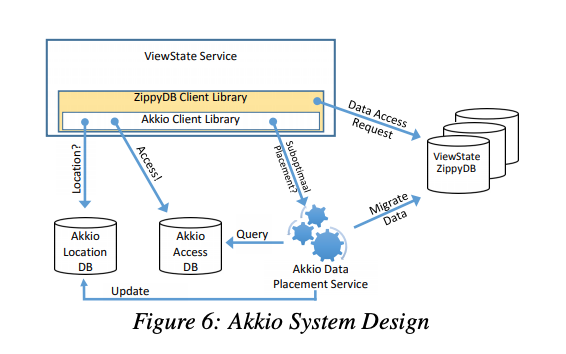

# Summary
## Introduction
- Akkio is a locality management service layered between client applications and distributed datastore systems
- It determines how and when to migrate data to reduce response times and resource usage.
- Akkio primarily targets multi-datacenter geo-distributed datastore systems
- Its design was motivated by the observation that many of Facebook’s frequently accessed datasets have low R/W ratios that are not well served by distributed caches or full replication
- Akkio’s unit of migration is called a µshard
- It can support trillions of µ-shards and process many 10’s of millions of data access requests per second
# # Managing data access locality
- Managing data access locality in geo-distributed systems is important because doing so can significantly improve data access latencies.
    - Intra-datacenter communication latencies are two orders of magnitude smaller than cross-datacenter communication latencies
    - e.g., 1ms for intra data center vs. 100ms for cross data center
- Locality management can also significantly reduce cross-datacenter bandwidth usage
    - This is important because the bandwidth available between datacenters is often limited
- Managing locality is all the more challenging when considering that access patterns can change geographically over time
    - when shifting workload from one datacenter operating at high utilization (e.g., during its day) to another operating at low utilization
- Akkio argue that explicit data migration is a necessary mechanism for managing data access locality in geodistributed environments
    - Main reason is, existing alternatives have serious drawbacks in many scenarios
    - Distributed caches can be used to improve data read access locality
    - However, because misses often incur remote communications, these caches require extremely high cache hit rates to be effective, thus demanding significant hardware infrastructure.
    - Distributed caches do not typically offer strong consistency
- Another alternative is to fully replicate data with a copy in each datacenter to allow for (fast) localized read accesses
    - However, as the number of datacenters increases, storage overhead becomes exorbitant with large amounts of data, and also write overheads increase significantly, as all replicas need to be updated on each write
## Akkio
- Akkio is a locality management service for distributed datastore systems with following aim 
    - Improve data access response times
    - Reduce cross-datacenter bandwidth usage 
    - Reduce the total amount of storage capacity needed
- Akkio is layered between client applications servicing client requests and the distributed datastore systems used natively by the client applications.
    - It decides in which datacenter to place and how and when to migrate data
    - It does so in a way that is transparent to its clients and the underlying datastore system.
- Akkio helps direct each data access to where the target data is located
    - It tracks each access to be able to make appropriate placement decisions
## µ-shards
- Having migration as the basis for providing data access locality raises following questions
    - What is the right granularity for migrating data? 
- A ubiquitous method in distributed datastore systems is to partition the data into shards using key ranges or key hashing. 
    - Shards serve as the unit for replication, failure recovery, and load balancing. 
    - Each shard is on the order of one to a few tens of gigabytes, is assigned in its entirety to a node, and multiple shards (10s – 100s) are assigned to a node. 
    - Shard sizes are set by the datastore administrator to balance (i) the amount of metadata needed to manage the shards with (ii) effectiveness in load balancing and failure recovery.
- Akkio advocates for the notion of finer-grained datasets to serve as the unit of migration when managing locality. 
    - These finer-grained datasets are called `µ-shards`
    - Each µ-shard is defined to contain related data that exhibits some degree of access locality
with client applications.
    - It is the application that determines which data is assigned to which µ-shard.
    - µ-shard sizes typically vary from a few hundred bytes to a few megabytes in size
    - µ-shard contains multiple key-value pairs or database table rows
    - Each µ-shard is assigned (by Akkio) to a unique shard in that a µ-shard never spans multiple shards.
## µ-shards vs shards
- The primary difference between shards and µ-shards, besides size, is the way data is assigned to them.
- With the former, data is assigned to shards by key partitioning or hashing with little expectation of access locality.
- With the later, the application assigns data to µ-shards with high expectation of access locality.
- As a result, µ-shard migration has an overhead that is an order of magnitude lower than that of shard migration, and its utility is far higher.
- The motivation is that only the client applications have the domain knowledge to best determine which data are related and likely to be used together
## ZippyDB
- ZippyDB is Facebookinternally developed databases
- support µ-shards as a first class abstraction in the sense that each access request also includes a µ-shard id 
- It is scalable key-value store system
- ZippyDB’s data is partitioned horizontally, with each partition assigned to a different shard.
- Each shard may be configured to have multiple replicas, with one designated to be the primary and the others referred to as secondaries
## Akkio’s functionality
- Akkio is implemented as a layer between client applications and the underlying datastore system that implements sharding
- Although µ-shards are defined by the client applications, Akkio manages them in an application-transparent manner
- Akkio is responsible for: 
    - (i) tracking client-application accesses to µshards so it can take access history into account in its decision making; 
    - (ii) deciding where to place each µshard; 
    - (iii) migrating µ-shards according to a given migration policy for the purpose of reducing access latencies and WAN communication; and 
    - (iv) directing each access request to the appropriate µ-shard  
- Akkio takes capacity constraints and resource loads into account in its placement and migration decisions, even in the face of a heterogeneous environment with a constantly churning hardware fleet.
- Akkio is able to support a variety of replication configurations and consistency requirements (including strong consistency) as specified by each client application service
-  This flexibility is provided because the client application service owners are in the best position to make the right tradeoffs between availability, consistency, resource cost-effectiveness, and performance.
## Other applications of Akkio
- Akkio can be used to migrate µshards between cold storage media (e.g. HDDs) and hot storage media (e.g., SSDs) on changes in data temperatures
# Motivation
##  Capital and operational costs matter
- Consider an organization with ten datacenters and many hundreds of petabytes of data that must be accessible
- It is difficult to obtain transparent, publicly available pricing information on the true cost of storage.
- A lower bound for capital depreciation and operational costs could be on the order of two cents per gigabyte per month.
- This translates to $2 million per 100 petabytes per month
## Service request movements
- The datacenters from which data access requests originate can vary over time, even for data accessed on behalf of a unique user. 
- A change in the requesting datacenter can arise, for example, 
    - because the user travels from one region to another, or, 
    - more likely, because service workload is shifted from a datacenter with high loads to another with lower loads in order to lower service request response latencies. 
- The alternative to shifting workload to other datacenters at peak times would be to increase the capacity of the overloaded datacenter to deal with peak influx of service requests. 
- But this comes with significant operational overheads, which are hard to justify when other datacenters are mostly idle at the same time, given diurnal request patterns.
## Low read-write ratios
- Many important datasets exhibit low read-write ratios
- Overall, Facebook has on the order of 100PB of periodically accessed data that has a read-write ratio below 5.
- Note that with low read-write ratios, fully-replicated data would incur significant cross-datacenter communication, as all replicas would have to be updated on writes.
## Ineffectiveness of distributed caches
- A common strategy to obtain localized data accesses is to deploy a distributed cache at each datacenter.
    -  In practice this alternative is ineffective for most of the workloads important to Facebook. 
    - First, unless the cache hit rate in the cache is extremely high, average read latencies will be high if the target data is not located in the local datacenter. 
    - Because of this, caching will demand significant hardware infrastructure, as the caches at each datacenter would have to be large enough to hold the working set of the data being accessed from the datacenter.
- Second, low read-write ratios lead to excessive communication over cross-datacenter links, because the data being written will, in the common case, be remote.
- Finally, many of the datasets accessed by our services require strong consistency. 
    - While providing strongly consistent caches is possible, it significantly increases the complexity of the solution, and it incurs a large amount of extra cross-datacenter communication, further exacerbating WAN latency overheads. 
    - It is notable that the widely popular distributed caching systems that are scalable, such as Memcached or Redis, do not offer strong consistency. And for good reason.
## Separate locality management layer
- Akkio is implemented as a layer between the application service and the underlying distributed datastore system.
- This raises the question of whether it would make more sense to implement Akkio’s functionality directly within the datastore system.
-  Technically, it would be possible,
but we argue that this is not a good idea for two reasons.
    - The size of shards are carefully selected by the datastore architects for the purpose of managing load balancing and failure recovery, taking into account the configuration and other metadata needed to manage the shards
        - Maintaining this data at µ-shard cardinality would come at high storage overheads with 100’s of billions of µ-shards vs. 10,000’s of shards. 
        - Restructuring a datastore system to achieve the level of scale required to support µ-shards across each of its layers would require non-trivial changes
    - many application services use data that are not well-served by Akkio-style locality management;
        - e.g., Google search or Facebook’s social graph. 
# Background
- When running on top of ZippyDB, Akkio places µ-shards on, and migrates µshards between different such replica set collections.
- Once shards have been provisioned, then ZippyDB’s Shard Manager assigns each shard replica to a specific ZippyDB server while obeying the specified policy rules.
# Akkio Design and Implementation
## Design guidelines
Akkio’s design is informed by three primary guidelines.
-  Akkio uses an additional level of indirection
    - it maps µ-shards onto shard replica set collections whose shards are in turn mapped to datastore storage servers.
    - This allows Akkio to rely on ZippyDB functionality to provide replication, consistency, and intra-cluster load balancing. 
-  Akkio is structured so as to keep most operations asynchronous and not on any critical path
    - the only operation in the critical path is the µshard location lookup needed for each data access to identify in which replica set collection the target µ-shard is located
- Akkio minimizes the intersection with the underlying application datastore tier
    - The only two points where the datastore system and Akkio meet are
in the datastore client libraries and in Akkio’s migration logic which is specific to the datastore.
# Requirements
## Client
- The client application service must partition data into µ-shards, which are expected to exhibit a fair degree of access locality for Akkio to be effective. 
- the client application service must establish its own µ-shard-id scheme that identifies its µ-shards. 
    - µ-shard-ids can be any arbitrary string, but must be globally unique. 
- To access data in the underlying application database, the client application service must specify the µ-shard the data belongs to in the call to the database client library. 
    - For databases that do not support µ-shards natively as ZippyDB does, the function used to access data is modified to include a µ-shard-id as an argument to each access request; e.g., read(key) must be modified to read(µ-shard-id,key).
## Underlying Database
- The database must ensure µ-shards do not span shards. 
    - Because ZippyDB understands the notion of µ-shards, it will never partition µ-shards. 
    - Many databases support explicit partition keys that inform the database how to partition data (e.g., MySQL, Cassandra). 
    - Yet other databases may recognize key prefixes when partitioning data (e.g., HBase, CockroachDB).
- The underlying application database must provide a minimal amount of support so that Akkio can implement migration while maintaining strong consistency.
    - Because the specific features supported by different datastore systems will vary, the µ-shard migration logic that Akkio implements must be specific to the underlying datastore system being supported. 
    - For example, some databases, including ZippyDB, offer access control lists (ACLs) and transactions, which are sufficient for implementing µ-shard migration. 
    - Other databases, including Cassandra, offer timestamp support for ordering writes, which is also sufficient.
# Architectural overview

## Akkio Location Service
- The Akkio Location Service (ALS) maintains a location database. 
- The location database is used on each data access to look up the location of the target µshard
- the ZippyDB client library makes a call to the Akkio client library getLocation(µ-shard-id) function
- which returns a ZippyDB location handle (representing a replica set collection) obtained from the location database. 
- The location handle enables ZippyDB’s client library to direct the access request to the appropriate storage server. 
- The location database is updated when a µshard is migrated
## Access Counter Service
- An Access Counter Service (ACS) maintains an access counter database, which is used to track all accesses so that proper µ-shard placement and migration decisions can be made. 
- Each time the client service accesses a µ-shard, the Akkio client library requests the ACS to record the access, the type of access, and the location from which the access was made. 
- This request is issued asynchronously so that it is not in the critical path.

## Data Placement Service
- The ACS is primarily used by Akkio’s third service, the Data Placement Service (DPS), which decides where to place each µ-shard so as to minimize access latencies and reduce resource usage. 
- The DPS also initiates and manages µ-shard migrations. 
- The Akkio Client Library asynchronously notifies the DPS that a µ-shard placement may be suboptimal whenever a data access request needs to be directed to a remote datacenter. 
- The DPS re-evaluates the placement of a µ-shard only when it receives such a notification. 
- This ensures the DPS triggers migrations only when needed, thus effectively prioritizing migrations and preventing unnecessary migrations for µ-shards that are not being accessed. Note,

# Reference
https://engineering.fb.com/2018/10/08/core-data/akkio/

https://www.usenix.org/system/files/osdi18-annamalai.pdf